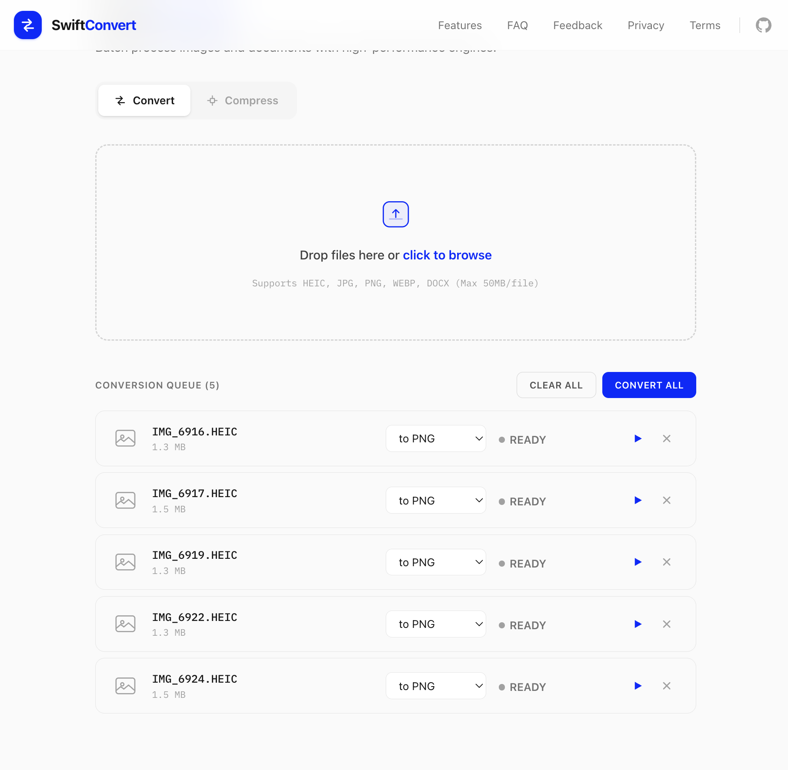
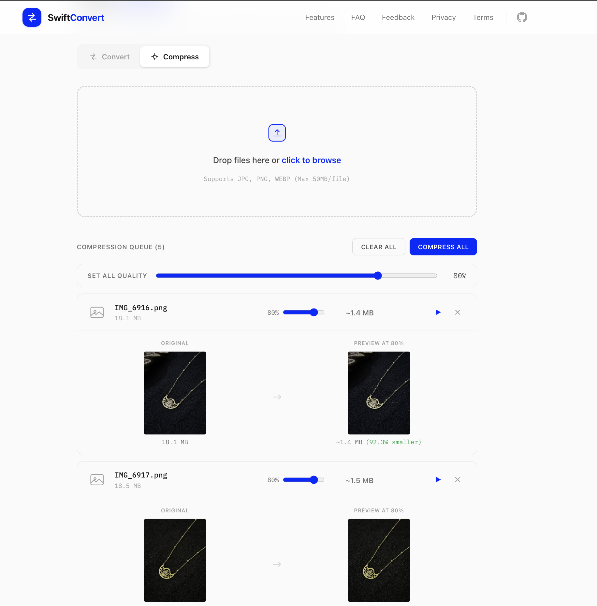
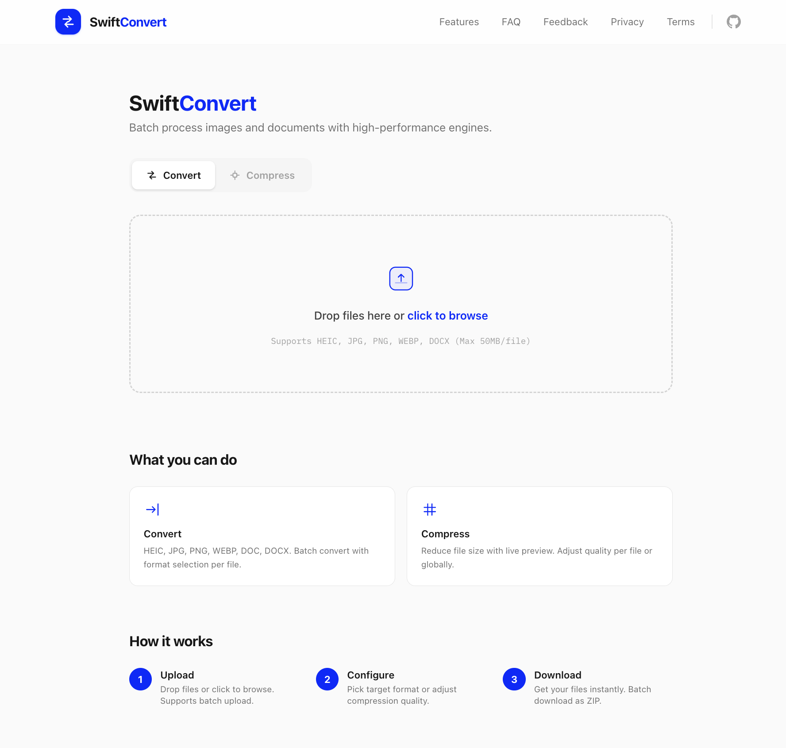

<p align="center">
  
</p>

<h1 align="center">SwiftConvert</h1>

<p align="center">
  Free online file converter. Convert and compress images and documents instantly.<br/>
  No signup, no limits, no watermarks. Files are never stored.
</p>

<p align="center">
  <a href="#features">Features</a> &middot;
  <a href="#screenshots">Screenshots</a> &middot;
  <a href="#getting-started">Getting Started</a> &middot;
  <a href="#api">API</a> &middot;
  <a href="#deployment">Deployment</a>
</p>

---

## Features

- **Convert** - HEIC, HEIF, JPG, PNG, WEBP, DOC, DOCX with per-file format selection
- **Compress** - JPG, PNG, WEBP with quality slider and real-time size preview
- **Batch processing** - Upload multiple files, process sequentially, download individually or as ZIP
- **Smart ZIP** - Large batches split into chunked ZIPs (20 files each) to avoid memory issues
- **Privacy first** - Files processed in memory, never saved to disk or logged
- **No signup** - No accounts, no daily limits, no paywalls

### Supported Conversions

| Source | Target |
|--------|--------|
| HEIC / HEIF | PNG, JPG, WEBP |
| JPG / PNG / WEBP | PNG, JPG, WEBP |
| DOC / DOCX | PDF |

## Screenshots

<!-- Add your screenshots to the devs/ folder and uncomment these lines -->

### Home - Convert Tab


### Compress Tab with Live Preview


### Full Page View


## Getting Started

### Prerequisites

- Node.js 18+
- npm

### Install & Run

```bash
git clone https://github.com/dev-mohsin/swift-convert.git
cd swift-convert
npm install
npm run dev
```

Open [http://localhost:3000](http://localhost:3000).

### LibreOffice (optional)

Only needed for DOC/DOCX to PDF conversion. Image conversions work without it.

```bash
# macOS
brew install --cask libreoffice

# Ubuntu/Debian
apt install libreoffice
```

Check `/api/health` to verify detection.

## API

### POST /api/convert

Convert a file to a target format.

```bash
curl -o output.jpg \
  -F "file=@photo.heic" \
  -F "target=jpg" \
  http://localhost:3000/api/convert
```

### POST /api/compress

Compress an image with quality control.

```bash
curl -o compressed.jpg \
  -F "file=@photo.jpg" \
  -F "quality=75" \
  http://localhost:3000/api/compress
```

Returns `X-Original-Size` and `X-Compressed-Size` headers.

### GET /api/health

```json
{
  "status": "ok",
  "sharp": true,
  "soffice": { "available": true, "path": "/usr/bin/soffice" }
}
```

### Limits

- Max file size: 50MB (returns 413)
- File type validated by magic bytes, not extension
- Supported compress formats: JPG, PNG, WEBP
- Quality range: 1-100

## Deployment

### Vercel (Recommended)

Works out of the box on Vercel free tier:

1. Push to GitHub
2. Import at [vercel.com](https://vercel.com)
3. Deploy

> Note: DOC/DOCX conversion requires LibreOffice which is not available on Vercel. Image conversions work perfectly.

### Self-hosted

```bash
npm run build
npm start
```

For production, use PM2:

```bash
npm install -g pm2
npm run build
pm2 start npm --name swift-convert -- start
```

## Tech Stack

- **Framework** - Next.js 15+ (App Router, TypeScript)
- **Styling** - Tailwind CSS v4
- **Image processing** - sharp
- **HEIC decoding** - heic-convert
- **Document conversion** - LibreOffice headless
- **File detection** - file-type (magic bytes)
- **Batch downloads** - JSZip

## Project Structure

```
src/
  app/
    page.tsx          # Main UI (Convert + Compress tabs)
    layout.tsx        # Header, footer, SEO metadata
    not-found.tsx     # 404 page
    feedback/         # Feedback form
    privacy/          # Privacy policy
    terms/            # Terms of service
    sitemap.ts        # Auto-generated sitemap
    robots.ts         # Robots.txt config
    api/
      convert/        # File conversion endpoint
      compress/       # Image compression endpoint
      health/         # Health check endpoint
  lib/
    convert.ts        # Conversion logic (sharp, heic-convert, LibreOffice)
```

## Contributing

Contributions are welcome! See [CONTRIBUTING.md](CONTRIBUTING.md) for guidelines.

- Fork the repo and create a feature branch
- Open an [issue](https://github.com/dev-mohsin/swift-convert/issues) to report bugs or suggest features
- Submit a Pull Request with a clear description

## License

MIT
